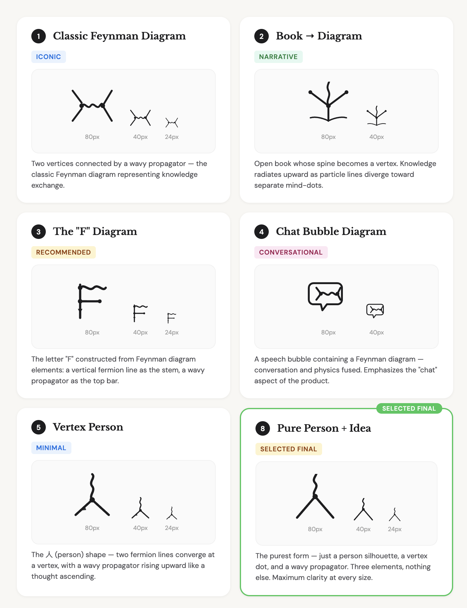

# Feynman

> "You learn by asking questions, by thinking, and by experimenting." — Richard Feynman

**Chat with books. Great minds join in.**

An interactive knowledge network built on the world's most important books and great minds. With Feynman, you can chat with the books you want to read to quickly understand them and explore the broader context around them. You can also start from a topic, and Feynman will surface the most relevant books to help you build a knowledge system grounded in them. As you chat, a continuously evolving network of agent-simulated great minds — scholars, scientists, practitioners — automatically join the conversation, so you read, learn, and discuss ideas together with the most relevant thinkers. Books, minds, and ideas are all interconnected nodes in this network — not isolated features, but parts of a navigable map of human thought.

What makes this different:

- **Knowledge beyond any single source** — a four-layer content system (RAG → Content Fetch → Web Search → LLM Knowledge) means answers draw on the work's text, metadata from Open Library/Google Books/Wikipedia, real-time web results, and the model's own training — connecting ideas across the full depth of available knowledge.
- **A network that grows as you explore** — there's no static catalog. Books and sources are discovered through topic exploration, search, chat mentions, uploads, and community voting. Every title mentioned in a conversation gets added automatically, expanding the network organically.
- **Great minds as living nodes** — great minds accumulate memory from conversations, becoming richer and more nuanced over time. They are not a separate feature but part of the knowledge network itself — connected to their works, their ideas, and to each other. You can upload your own minds — or anyone you admire — from a Twitter profile, blog, or text to expand the network.

### Why I built this

Feynman is **not** a replacement for reading. I'm a devoted paper-book lover — the tactile act of flipping through physical pages puts me in a near-meditative state, and nothing replaces that.

Richard Feynman rarely read a book cover to cover — he approached books with questions, pulled insights from multiple sources, and moved on when a book had nothing left to teach him. I read the same way. When I want to explore a new domain, I need to know *which* books are worth the deep read and how they fit together. This tool helps me:

- **Scout before committing** — quickly understand what a book covers and whether it deserves my full attention.
- **Build a knowledge scaffold** — when I'm entering an unfamiliar field, it synthesizes key ideas across multiple authoritative works so I can form an initial mental map before diving in.
- **Go beyond the text** — imagine sitting down with the author for a few hours; you'd learn far more than what's on the page. Feynman gives you that experience — because the AI draws on broader knowledge related to the book, every conversation surfaces valuable context and insights you wouldn't get from reading alone.

In short: Feynman helps you read the way Feynman did — not replace reading itself.

### Beyond books

In 1985, Steve Jobs said: *"Someday, some student will be able to not only read the words Aristotle wrote, but ask Aristotle a question and get an answer."* That idea stuck with me. Every book is a window into a great mind — but a great mind is far more than any single book.

If you could actually sit down with Aristotle, or Feynman, or Adam Smith, you'd get something no book alone can give: their way of thinking, applied to your questions.

That's why great minds aren't a secondary feature — they're an integral part of the knowledge network. Books, ideas, and thinkers are all interconnected nodes. Minds join your conversations, challenge your assumptions, and bring perspectives that emerge from the connections between works. You can also upload your own minds into the network to expand the scope of collective human thought.

---

Feynman is an interactive knowledge network powered by AcademiAI. Three ways to enter:

**1. Enter through a book** — Ask questions and get answers grounded in the work's actual content, with every claim traced back to a specific passage. A four-layer content system (RAG, Content Fetch, Web Search, LLM Knowledge) connects the book to broader context and related knowledge across the network.

**2. Enter through a topic** — Curious about microeconomics but don't know where to start? Feynman discovers the most relevant books, generates the questions you should be asking, and teaches you through conversation — all grounded in authoritative sources. Every search, chat mention, and topic click adds new works to the network automatically.

**3. Enter through a mind** — As you explore, Feynman automatically invites highly relevant great minds — scholars, scientists, practitioners — to join the conversation as AI agents. These minds accumulate memory from conversations, becoming richer over time. You can also invite specific minds yourself, discover new ones through the knowledge graph, or upload your own (via a Twitter profile, blog URL, or text) to connect and expand the network.

---

## Books as Knowledge Nodes

Have a book but don't want to read all 300 pages? Chat with it instead. Ask anything and get answers backed by a four-layer content system — so you always learn more than what's on the page:

| Priority | Skill | What it does |
|----------|-------|-------------|
| 1st | **RAG** | Retrieves relevant passages from the book's indexed content |
| 2nd | **Content Fetch** | Pulls information from Open Library, Google Books, and Wikipedia |
| 3rd | **Web Search** | Uses Gemini Search Grounding for real-time web answers |
| 4th | **LLM Knowledge** | Falls back to the model's training knowledge |

Every answer includes clickable `[1]`, `[2]` citations — click to see exactly which passage the answer came from. No black-box responses.

Select multiple books and ask questions across all of them — Feynman searches your entire library to find the most relevant passages regardless of source.

## Topics as Entry Points

Don't have a book? Start with a topic. There's no static catalog — the network builds itself from every conversation.

Pick an interest — Psychology, Philosophy, Economics, Physics, or anything — and Feynman:
1. **Discovers the right books** via LLM curation (no predefined catalog)
2. **Proposes study questions** that map out what you need to understand
3. **Answers your questions** grounded in the discovered books' content
4. **Grows your library organically** as you explore deeper

Your library also expands through search, chat mentions, PDF/TXT uploads, and community voting (books with enough upvotes get auto-indexed).

## Great Minds as Living Nodes

Books are one layer of the network. The minds behind them are another. You can chat and learn with a continuously evolving network of great minds — scholars, academics, and great practitioners across every field.

AI agents simulate these thinkers, faithfully capturing how they reason and argue, grounded in their actual works. When you chat about a book or explore a topic, relevant minds automatically join the conversation — and you see exactly who joined with a "X joined the discussion" notification, just like a group chat.

### Great Minds design principles

Great Minds is guided by three primary commitments:

- **Show our appreciation for humanity's great wisdom tradition** — by re-understanding and re-presenting the ideas, books, and thinkers that shaped civilization in a form people can actively engage with.
- **Expand the scope of that tradition** — by connecting disciplines, surfacing overlooked relationships, and making it easier to add new minds, new works, and new intellectual bridges.
- **Help more people benefit from it directly** — by turning distant or intimidating bodies of knowledge into something navigable, conversational, and practically useful.

Under those commitments, the feature follows a few core principles:

- **Build a noosphere, not just a directory** — the goal is not a static list of famous names, but an evolving network of human thought in which minds, books, ideas, and conversations can meaningfully connect.
- **Let structure emerge instead of forcing categories** — traditional academic disciplines are useful, but Great Minds should not be limited by inherited taxonomies. With embeddings, related minds and ideas can organize themselves by semantic proximity, revealing clusters, bridges, and surprising neighbors.
- **Treat knowledge as a space to navigate** — hyperlinks and tags are helpful, but they only go so far. Great Minds aims to become a map of thought where users can move from one mind to nearby minds, nearby ideas, and nearby books.
- **Use embeddings to reveal the geometry of ideas** — books, thinkers, and conversations can all be embedded into a shared vector space. In that space, similarity becomes distance, interdisciplinary links become bridges, and the topology of knowledge becomes explorable.
- **Favor discovery over rigid classification** — instead of reproducing a fixed school-like hierarchy, the product should help users discover how thought actually relates across domains, including continuous transitions between philosophy, science, art, technology, and beyond.
- **Keep human meaning in the loop** — vector structure is powerful, but it is not truth itself. Great Minds should make relationships legible, grounded, and interpretable so users can evaluate them rather than passively accept them.
- **Make the network alive and cumulative** — the noosphere is not a frozen archive. Minds should evolve through conversation, the network should grow as new material is added, and users should feel they are exploring a living knowledge world rather than a closed canon.

- **Minds join your conversations** — when you chat about a book or topic, relevant minds are automatically invited. Reading "Wealth of Nations"? Adam Smith explains his reasoning while Marx challenges it and Keynes offers a different lens. Their replies appear as individual messages in the conversation timeline, not hidden in a sidebar.
- **Continuity across turns** — once a mind joins, they stay in the conversation and see the full chat history. As the topic shifts, new minds join automatically with a notification, while existing ones continue to participate.
- **A network that evolves** — these agents aren't static. They accumulate memory from conversations, becoming richer and more nuanced over time while staying faithful to who they are.
- **Upload your own minds** — create a mind agent from a Twitter profile, blog URL, or pasted text. Upload yourself, people you admire, or anyone whose thinking you want in the network — and connect them to the existing web of great minds.
- **Knowledge graph** — the Great Minds page features an interactive force-directed network visualization. Minds cluster by domain, and you can discover new related minds by clicking "Discover nearby minds" on any node. New minds appear with a highlighted badge and the view auto-pans to show them.
- **50+ pre-generated minds** — Feynman ships with minds across philosophy, physics, economics, psychology, literature, tech, startups, and more — from Aristotle and Feynman to Marc Andreessen and Naval Ravikant. New minds are generated on-demand whenever you need them.

Like having a study group of the most brilliant people in history, always available to think alongside you.

## Token Usage Transparency

Every LLM call shows its token consumption in real time — chat, discovery, and search. No hidden costs.

## Quick Start

```bash
git clone https://github.com/steveyeow/feynman.git
cd feynman
python -m venv .venv
source .venv/bin/activate
pip install -r requirements.txt
cp .env.example .env   # add at least one API key
uvicorn app.main:app --reload
```

Open http://localhost:8000

## Configuration

Edit `.env` to set your LLM provider keys. At least one is required:

| Variable | Provider | Notes |
|----------|----------|-------|
| `GEMINI_API_KEY` | Google Gemini | Recommended — supports embeddings + web search grounding |
| `DEEPSEEK_API_KEY` | DeepSeek | Cost-effective chat, no embeddings |
| `OPENAI_API_KEY` | OpenAI | GPT-4o-mini for chat, text-embedding-3-small for embeddings |
| `KIMI_API_KEY` | Moonshot Kimi | Chat only, no embeddings |
| `ANTHROPIC_API_KEY` | Anthropic Claude | Chat only, no embeddings |

The system auto-selects the best available provider and falls back through the chain: Gemini → DeepSeek → OpenAI → Kimi → Anthropic.

### Library settings

| Variable | Default | Description |
|----------|---------|-------------|
| `VOTE_THRESHOLD` | 3 | Upvotes needed to auto-index a book |
| `DISCOVERY_INTERVAL` | 21600 | Seconds between scheduled discovery runs (0 to disable) |
| `DISCOVERY_BATCH_SIZE` | 5 | Max books discovered per scheduled run |
| `TOPIC_DISCOVER_COUNT` | 5 | Books discovered per topic click |

## Tech Stack

- **Backend**: Python / FastAPI, SQLite with vector embeddings stored as BLOBs
- **Frontend**: Vanilla JS SPA, hash-based routing, no framework dependencies
- **LLM**: 5-provider auto-fallback (Gemini, DeepSeek, OpenAI, Kimi, Anthropic)
- **RAG**: Cosine similarity over embeddings + Gemini Search Grounding
- **Persistence**: Chat sessions in localStorage, book data in SQLite

## Logo

The design started from a simple insight: Richard Feynman invented [Feynman diagrams](https://en.wikipedia.org/wiki/Feynman_diagram) — particle interaction diagrams where lines meet at vertices and wavy propagators carry forces between them. That visual language maps perfectly onto what this product does: minds meeting, exchanging knowledge, and leaving enriched.

We explored several directions built on this idea:



We chose Concept 8 — the purest form of the **人** shape (the Chinese character for "person"): just two lines forming a wide stance, a vertex dot, and a single wavy propagator rising upward. Three elements, nothing else. It reads as person, book, tree of knowledge, and Feynman diagram — four meanings in one mark, with maximum clarity at every size.

### When Feynman's wavy propagator meets the Dao De Jing

Claude's design ability is truly top-tier. I simply asked it to come up with a few logo versions based on its understanding of the Feynman product. It gave me five concepts, all inspired by the wavy propagator from Feynman diagrams. When I saw Concept 5, it immediately struck me as looking like **人** — the Chinese character for "person" — and from another angle, like a book placed face-down. Absolutely perfect.

What's more, in its explanation of Concept 2, Claude mentioned *"two fermion lines diverge toward separate mind-dots."* It probably didn't even realize it, but Concept 5 also echoes a passage from the *Dao De Jing*: *"冲气以为和，二生三，三生万物"* — opposing forces blend into harmony; two gives birth to three, and three gives birth to the ten thousand things.

All concept SVGs are included in `app/static/` — run the app and visit `/static/logo-all-concepts.html` to preview them interactively.

## Product Updates

### Mar 18, 2026 — Minds Network: Vector-Driven Graph

Rebuilt the Minds Network graph with vector embeddings. Connections and spatial layout are now driven by semantic similarity instead of keyword/domain matching — thinkers are linked by shared ideas, not surface-level tags. The graph uses PCA-projected embedding coordinates for layout, so intellectual proximity is visible at a glance. Cleaner connections, more meaningful clusters, and a foundation for future discovery features.

### Mar 10, 2026 — Great Minds Network

AI agents that simulate great thinkers now join your conversations. 50+ pre-generated minds across philosophy, physics, economics, psychology, literature, tech, and more. Interactive knowledge graph, inline chat messages, session continuity, and the ability to create your own mind agents. See the [Great Minds as Living Nodes](#great-minds-as-living-nodes) section above for details.

### Feb 10, 2026 — v1: Chat with Books

The first version. Born from a simple frustration: when entering a new field, I needed to figure out which books were worth reading and how their ideas connected — before committing hours to any single one.

Two core capabilities: **chat with any book** using a multi-layered RAG skill system that grounds every answer in actual passages with citations, and **topic-driven knowledge building** that discovers relevant books via LLM, generates study questions, and teaches through conversation. The goal was to bring the Feynman method — question-driven, multi-source, never passive — into a practical tool.

## Community

Join the [Discord](https://discord.gg/BkYSkkwq) to share what you're reading, exchange reading methods, and tell me what you'd like to see in the product — or DM me directly on [Twitter/X](https://x.com/steve_yeow).

## License

MIT
